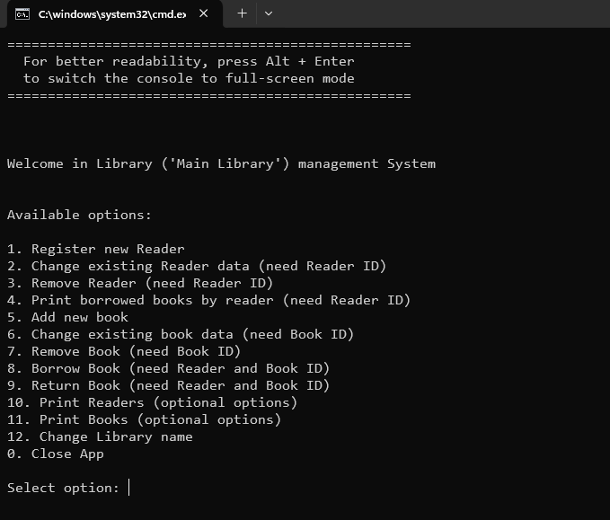

# Library Management System (Java, Console App)

A console application for managing a library, written in plain Java. It allows registering and editing readers, adding/removing books, borrowing and returning books, and printing records.

---

## Project Structure

```
Library_management/
├── config/
│   ├── books.csv           ← book data
│   ├── readers.csv         ← reader data
│   └── libraryName.txt     ← current library name
├── out/
│   └── production/
│       └── Library_management/ ← compiled class files (generated after running run.bat)
├── src/
│   ├── app/
│   │   ├── Main.java
│   │   └── LibraryApp.java
│   ├── data/
│   │   └── LibraryDataManager.java
│   └── model/
│       ├── Book.java
│       ├── Library.java
│       └── Reader.java
├── run.bat                ← batch file for compiling and launching the app
├── README.md              ← README file
└── LICENSE                ← license file
```

---

## How to Run the Project

### Requirements:
- Java 17 or later installed
- Operating system: Windows (classic Command Prompt preferred for UTF-8 compatibility)

### Instructions:
1. **Double-click** the `run.bat` file  
   *(or run it manually from the Windows Command Prompt)*
2. The script will:
    - set the console to UTF-8 encoding (`chcp 65001`)
    - compile all source files into the `out/production/Library_management` folder
    - run the program starting from the `app.Main` class
3. **Tip:** For better readability, press `Alt + Enter` to switch to full-screen console mode

---

## App Features

- Register and edit reader information
- Add, edit, or delete books
- Borrow and return books
- Print reader or book lists
- Change the library name (saved to file)
- Data is persisted in CSV format

---

## Preview – Main Menu

Here is what the main menu looks like in the console:



---

## Data Format

CSV and TXT files in the `config/` folder store the data:

- `books.csv`:
  ```
  id;title;author;publishingHouse;year;borrowerId
  ```
- `readers.csv`:
  ```
  id;firstName;lastName;birthDateYear;birthDateMonth;birthDateDay;borrowedBooksID
  ```
- `libraryName.txt`:
  ```
  My Library Name
  ```

---

## Encoding and Compatibility

- All source files and CSV data are saved in UTF-8
- For correct display of Polish characters, the following are required:
    - Console code page set to 65001
    - JVM encoding flag: `-Dfile.encoding=UTF-8`
- These are automatically configured in the `run.bat` script

---

## License

This project is licensed under the **MIT License** – see the [LICENSE](LICENSE) file for details.

---

© 2025 Bartosz T. [Lov3Life](https://github.com/Lov3Life)
